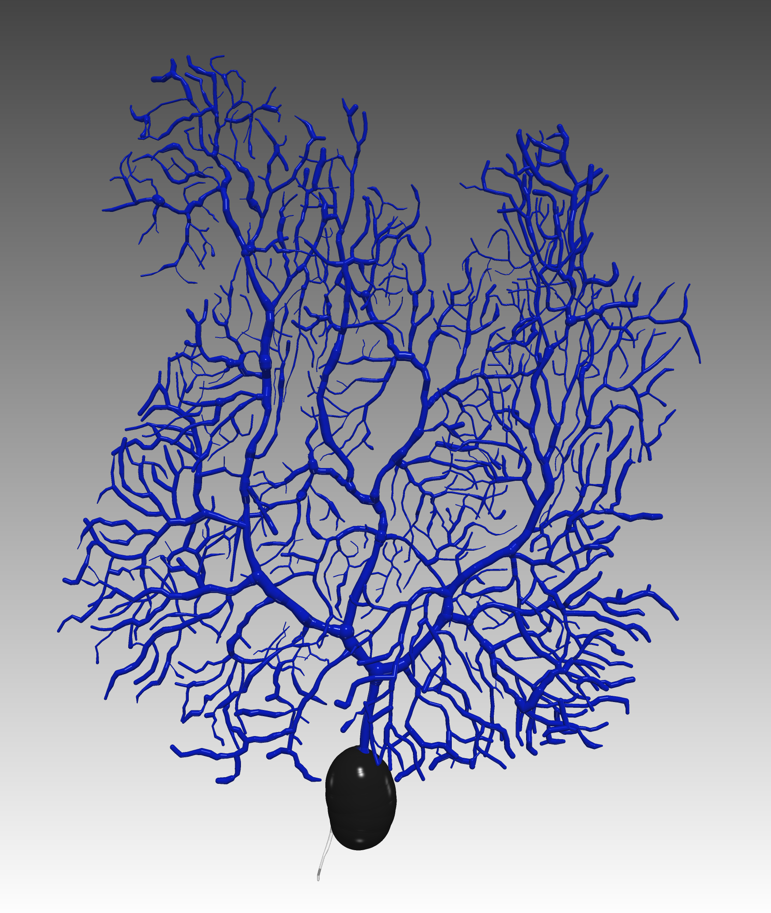
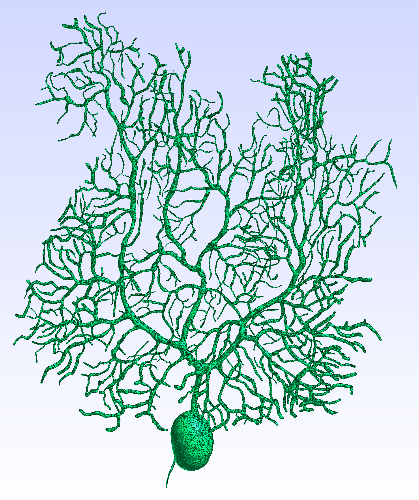

# Tetrahedral Mesh Generator from SWC Morphology Data

This program reads a SWC morphology file (`.swc`) and generates a tetrahedral mesh using 
spherical interpolation of the morphology. A watertight triangular surface mesh of the 
morphology can also be exported during the process.

This program doesn't detect branch intersection of the SWC morphology. For this procedure, 
please visit [https://github.com/CNS-OIST/SWCIntersectDetect](https://github.com/CNS-OIST/SWCIntersectDetect)

This program can not generate tetrahedral meshes from triangular surface meshes commonly
generated from Electron Microscopic (EM) imaging. For this purpose please visit [https://github.com/CNS-OIST/MultiCompMesher](https://github.com/CNS-OIST/MultiCompMesher).

# Prerequisite
* git
* a C++ compiler
* [CMake](https://cmake.org/) 
* [CGAL](https://www.cgal.org/) 
* [Boost](https://www.boost.org/) 

# Compilation
```
git clone https://github.com/CNS-OIST/SWCTetMesher.git
cd SWCTetMesher
mkdir build
cd build
cmake ..
make
```

# Usage
The commands below assume you are still in `SWCTetMesher/build`
    
* Basic usage
    ```
    ./SWCTetMesher SWC-FILE
    ```
    * SWC-FILE: A `.swc` morphology reconstruction file. 
    
        If a SWC file named `example.swc` is given, the tetrahedral mesh will be written to
        `example.mesh`. The output file can be changed using the `-o` option.


* Advance options  
    * `--output OUTPUT-FILE`, or `-o OUTPUT-FILE`: Change the output location of the tetrahedral mesh. If `OUTPUT-FILE` doesn't end with `.mesh`, this suffix will be appended.
    * `--surfmesh`: Also output the triangular surface mesh. If enabled, the surface mesh will be written to `OUTPUT-FILE.off`
    * `interp-distance`: Maximum distance between two spheres in the interpolation. A shorter distance results in a more accurate interpolation, but longer meshing time.
    
Other parameters can be set to control the meshing process and optimize the mesh quality. 
You can list them using

```
./SWCTetMesher -h
```
The usage of these parameters can be found in the 
[CGAL 3D mesh generation manual](https://doc.cgal.org/latest/Mesh_3/index.html).

# Concurrency (Parallel) mode

If [Intel's TBB library](https://software.intel.com/en-us/tbb) is installed and found, 
the program will try to use [concurrency mode](https://github.com/CGAL/cgal/wiki/Concurrency-in-CGAL) 
for meshing. Users can disable it and use sequential mode instead by setting the `ACTIVATE_CONCURRENCY` flag during compilation

```
cmake -DACTIVATE_CONCURRENCY=OFF ..
```

# Example

This example generates a tetrahedral mesh from a full Purkinje cell morphology.
The [SWC morphology](example/purkinje.swc) is curated in advance using the data in [Zang, etc., 2018](https://www.ncbi.nlm.nih.gov/pubmed?holding=modeldb&term=30089264).

We can visualize the morphology in [neuTube](https://www.neutracing.com/)


The command to generate the mesh is
```
# assumed still in SWCTetMesher/build

./SWCTetMesher example/purkinje.swc
```
The mesh is written to [purkinje.mesh](example/purkinje.mesh), then visualized
in Gmsh. Note that each component is labeled and colored individually. To use the mesh in [STEPS](http://steps.sourceforge.net), the user needs to
export it to the Abaqus inp format or the Gmsh 2.0 ASCii format in Gmsh.


The user can also export the [surface mesh](example/purkinje.off) for postprocessing or visualization in applications such as [Meshlab](http://www.meshlab.net/).
```
./SWCTetMesher example/purkinje.swc --surfmesh
```


Different parameters can be adjusted to generate a mesh with higher resolution, mainly
`fc-size`, `fc-distance` and `cc-size`.

```
./SWCTetMesher ../example/purkinje.swc  --fc-distance 0.075 --cc-size 0.5
```
 
