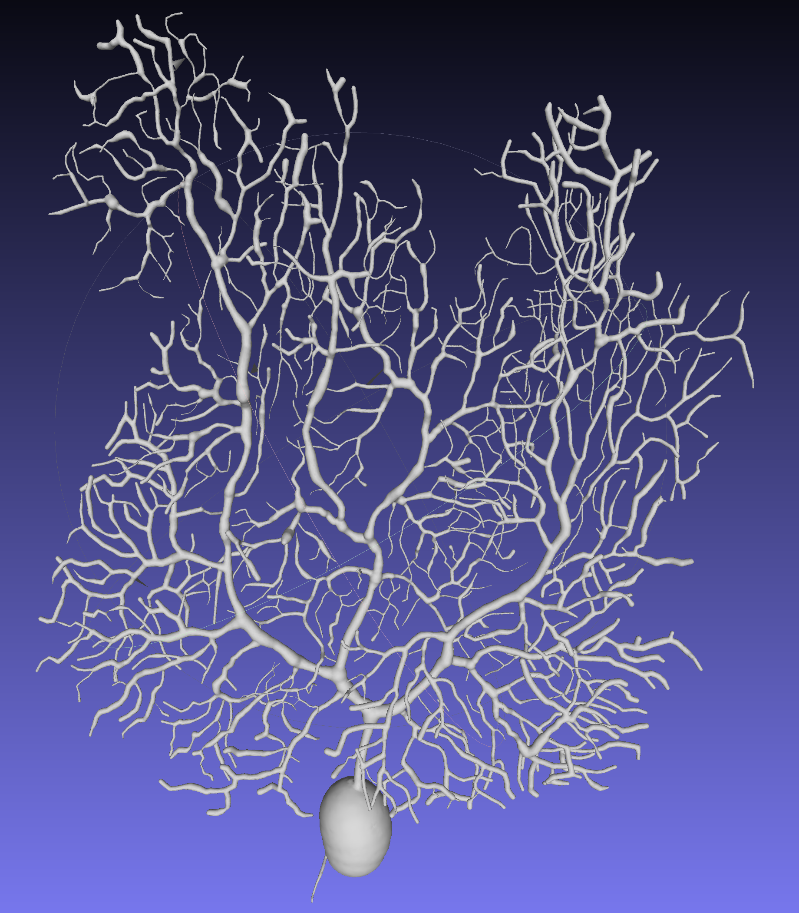

# Tetrahedral Mesh Generator from SWC Morphology Data

This program reads a SWC morphology file (`.swc`) and generates a tetrahedral mesh using 
spherical interpolation of the morphology. A watertight triangular surface mesh of the 
morphology can also be exported in the process.

Note that this program doesn't detect branch intersection of the SWC morphology. Thus a 
curation step for the raw SWC data may be required before using the program.

This program can not generate tetrahedral mesh from triangular surface meshes commonly
generated from Electron Microscopic (EM) imaging. For this purpose please visit [https://github.com/CNS-OIST/MultiCompMesher](https://github.com/CNS-OIST/MultiCompMesher).

# Prerequisite
* git
* a C++ compiler
* [CMake](https://cmake.org/) 
* [CGAL](https://www.cgal.org/) 
* [Boost](https://www.boost.org/) 

# Compilation
```
git clone https://github.com/CNS-OIST/SWCMesher.git
cd SWCMesher
mkdir build
cd build
cmake ..
make
```

# Usage
Below commands assume you are still in `SWCMesher/build`
    
* Basic usage
    ```
    ./SWCMesher SWC-FILE
    ```
    * SWC-FILE: A `.swc` morphology reconstruction file. 
    
        If a SWC file named `example.swc` is given, the tetrahedral mesh will be written to
        `example.mesh`. The output file can be changed using the `-o` option.


* Advance options  
    * `--output OUTPUT-FILE`, or `-o OUTPUT-FILE`: Change the output location of the tetrahedral mesh. If `OUTPUT-FILE` doesn't end with `.mesh`, this suffix will be appended.
    * `--surfmesh`: Also output the triangular surface mesh. If enable, the surface mesh will be written to `OUTPUT-FILE.off`
    * `interp-distance`: Maximum distance between two spheres in the interpolation. Shorter distance results in more accurate interpolation, but longer meshing time.
    
Other parameters can be set to control the meshing process and optimize the mesh quality. 
You can list them using

```
./SWCMesher -h
```
The usage of these parameters can be found in the 
[CGAL 3D mesh generation manual](https://doc.cgal.org/latest/Mesh_3/index.html).

# Concurrency (Parallel) mode

If [Intel's TBB library](https://software.intel.com/en-us/tbb) is installed and found, 
the program will try to use [concurrency mode](https://github.com/CGAL/cgal/wiki/Concurrency-in-CGAL) 
for meshing. User can disable it and uses sequential mode instead by setting the `ACTIVATE_CONCURRENCY` flag in compilation

```
cmake -DACTIVATE_CONCURRENCY=OFF ..
```

# Example

This example generates a tetrahedral mesh from a full Purkinje cell morphology.
The [SWC morphology](example/purkinje.swc) is curated in advance using the data in [Zang, etc., 2018](https://www.ncbi.nlm.nih.gov/pubmed?holding=modeldb&term=30089264).

We can visualize the morphology in [neuTube](https://www.neutracing.com/)


The command to generate the mesh is
```
# assume still in SWCMesher/build

./SWCMesher example/purkinje.swc
```
The mesh is written to [purkinje.mesh](example/purkinje.mesh), then visualized
in Gmsh. Note that each component are labelled and colored individually. To use the mesh in [STEPS](http://steps.sourceforge.net), the user need to
export it to the Abaqus inp format or the Gmsh 2.0 ASCii format in Gmsh.


The user can also export the [surface mesh](example/purkinje.off) for postprocessing or visualization in applications such as [Meshlab](http://www.meshlab.net/).
```
./SWCMesher example/purkinje.swc --surfmesh
```


Different parameters can be adjusted to generate a mesh with higher resolution, mainly
`fc-size`, `fc-distance` and `cc-size`.

```
./SWCMesher ../example/purkinje.swc  --fc-distance 0.075 --cc-size 0.5
```
 